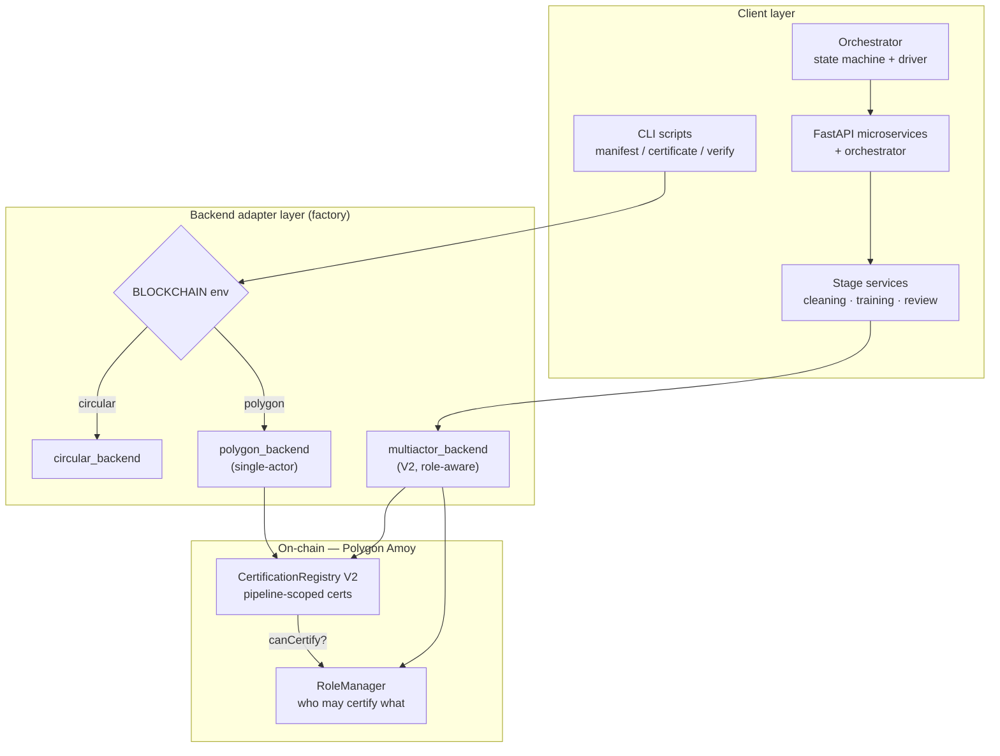
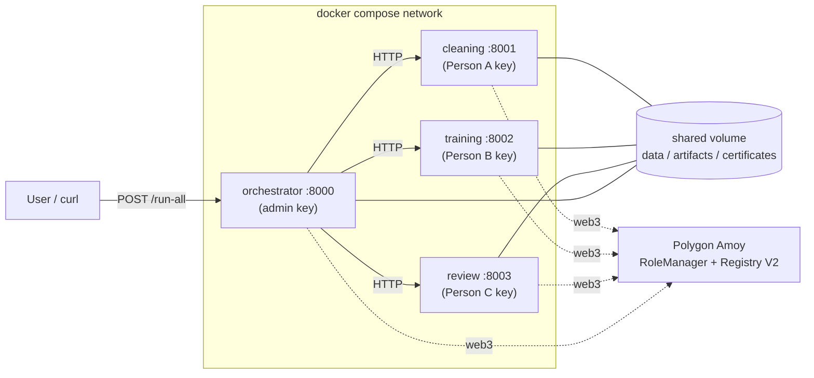
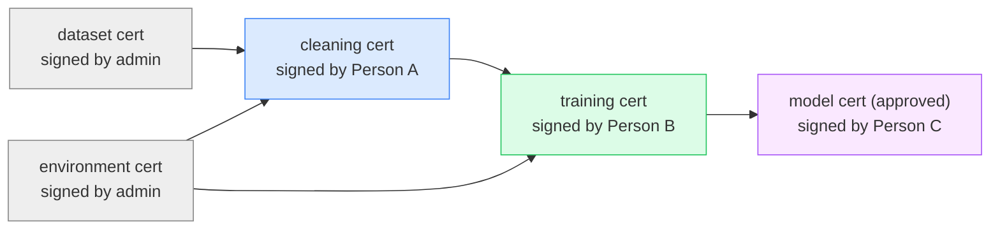
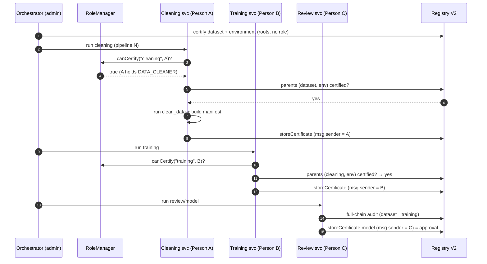
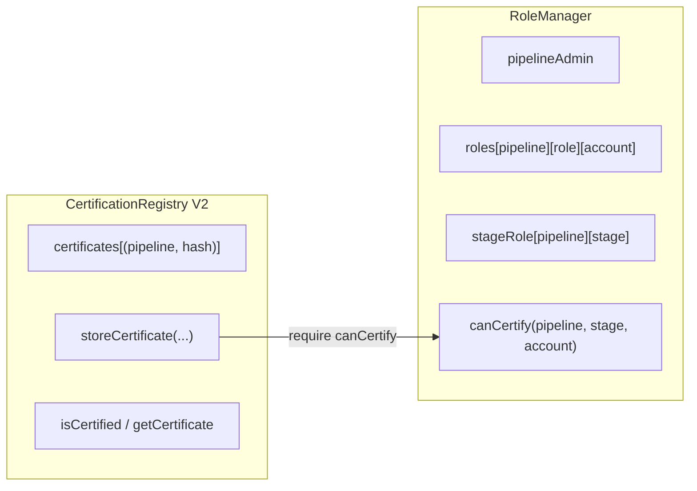
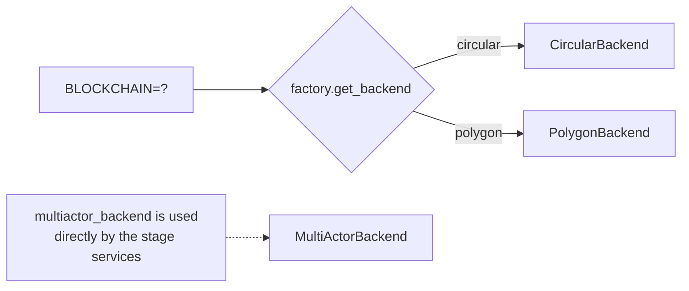

# Blockchain-Certified ML Pipeline — Multi-Actor Provenance on Polygon

> Tamper-evident, on-chain provenance for a machine-learning pipeline. Every
> stage (dataset → environment → cleaning → training → model) is hashed into a
> manifest and anchored on **Polygon**, with a **role-gated, multi-actor**
> workflow where each participant signs their own stage with their own wallet.
> The point is **verifiable provenance and accountability**, not model accuracy.

<p>
  
  
  
  
  
</p>

MSc Data Science internship project — University of Messina.

---

## Table of Contents
1. [What this is](#what-this-is)
2. [Key results](#key-results)
3. [System architecture](#system-architecture)
4. [The certificate chain](#the-certificate-chain)
5. [Multi-actor workflow](#multi-actor-workflow)
6. [Smart contracts & deployments](#smart-contracts--deployments)
7. [Blockchain-agnostic design](#blockchain-agnostic-design)
8. [Code structure](#code-structure)
9. [Getting started](#getting-started)
10. [Usage](#usage)
11. [Cost analysis](#cost-analysis)
12. [Security considerations](#security-considerations)
13. [Testing](#testing)
14. [Roadmap / future work](#roadmap--future-work)
15. [License](#license)

---

## What this is

A pipeline that trains an MLP classifier on the Iris dataset, but where **every
stage produces a cryptographic certificate anchored on a blockchain**. Each
certificate stores the SHA-256 hash of a *manifest* (a JSON describing the stage,
its evidence files, and its parent certificates). Because each stage references
its parents by hash, the certificates form a **tamper-evident audit chain**: change
any input and every downstream hash breaks.

The system evolved through three milestones:

| Milestone | What it delivered |
|---|---|
| **1. Circular → Polygon migration** | Circular Testnet shut down; migrated to Polygon Amoy behind a **blockchain-agnostic** backend interface (switch chains via one env var). |
| **2. Single-actor pipeline** | All 5 stages certified + verified on Polygon by one wallet. Cost captured. |
| **3. Multi-actor system** | Per-pipeline **roles** (RoleManager) + a role-aware registry (V2). Each stage is run and signed by a **different actor**, orchestrated end-to-end, exposed as **FastAPI microservices**, containerized with **Docker Compose**. |

---

## Key results

- **~23× cheaper on Polygon than Circular** for a full pipeline:

  | Backend | Full-pipeline certification cost |
  |---|---|
  | Circular (old) | ≈ **€0.32** |
  | Polygon Amoy | ≈ **€0.014** |

- Full multi-actor pipeline runs **end-to-end from a single HTTP call**, with each
  stage's on-chain `submitter` matching the assigned actor (verifiable on
  Polygonscan).
- **17 Foundry tests** pass (8 single-actor + 9 multi-actor).

---

## System architecture

Three layers: a **client layer** (scripts, stage services, and HTTP APIs), a
**backend adapter layer** (picks the chain), and the **on-chain layer** (two
separated contracts on Polygon).



### Microservice topology (Docker Compose)



Each container holds **only its own actor's private key** — key isolation is
enforced at the container boundary.

---

## The certificate chain

Certificates form a directed acyclic graph. **Root** stages (dataset,
environment) have no parents; each later stage references its **direct** parents
by manifest hash. Full lineage is *derived by traversal*, not duplicated.



> Tamper-evidence is transitive: `training` commits to `cleaning`'s hash, which
> commits to `dataset`'s hash — so altering the dataset breaks the whole chain
> without training needing to reference the dataset directly.

---

## Multi-actor workflow

Each stage service performs the same guarded sequence: prove role → verify
parents on-chain → run the stage → sign & certify. Any failed check stops the
stage (reject/recovery path).



The on-chain record after a run (`submitter` per stage):

| Stage | On-chain submitter | Role |
|---|---|---|
| dataset | admin | — (root) |
| environment | admin | — (root) |
| cleaning | Person A | DATA_CLEANER |
| training | Person B | MODEL_TRAINER |
| model | Person C | REVIEWER |

---

## Smart contracts & deployments

**Separation of concerns** — two contracts instead of one:



- **`RoleManager.sol`** — per-pipeline roles. `createPipeline` (caller becomes
  admin), `grantRole` / `revokeRole`, `setStageRole`, and the view `canCertify`.
  Roles are `bytes32` tags (`keccak256("DATA_CLEANER")`, …), scoped by `pipelineId`.
- **`CertificationRegistryV2.sol`** (contract name `CertificationRegistry`) —
  certificates keyed by `(pipelineId, manifestHash)`. `storeCertificate` calls
  `RoleManager.canCertify` and enforces the parent chain, all on-chain.
- **`CertificationRegistry.sol`** — the original single-actor V1 (kept for the
  single-actor Polygon demo and cost comparison).

### Deployed on Polygon Amoy (chainId 80002)

| Contract | Address |
|---|---|
| RoleManager | [`0x87344D59596D8BF19Dd2B2fb0a1DD879b708ed07`](https://amoy.polygonscan.com/address/0x87344D59596D8BF19Dd2B2fb0a1DD879b708ed07) |
| CertificationRegistry **V2** | [`0xC1C1DF3AaAce9bb7B51c104A72FCef0150d3952A`](https://amoy.polygonscan.com/address/0xC1C1DF3AaAce9bb7B51c104A72FCef0150d3952A) |
| CertificationRegistry V1 (reference) | [`0xa4D0B075B9AA1A0124347fE38974EC6618B4Aa59`](https://amoy.polygonscan.com/address/0xa4D0B075B9AA1A0124347fE38974EC6618B4Aa59) |

### Actor wallets (Amoy)

| Wallet | Role |
|---|---|
| `0x5d1a…205e` | admin / pipeline owner |
| `0x7329…CA6F` | Person A — DATA_CLEANER |
| `0x83EF…b966` | Person B — MODEL_TRAINER |
| `0xf596…DdB9` | Person C — REVIEWER |

---

## Blockchain-agnostic design

One environment variable selects the backend; nothing else changes.



`certificate_service.py` and `verify_certificate.py` never mention a chain — they
call `get_backend()`. The multi-actor path uses `MultiActorBackend` directly
because it is pipeline- and actor-aware.

---

## Code structure

```
.
├── src/
│   ├── hashing.py                 # SHA-256 of files
│   ├── manifest_service.py        # build a stage manifest (evidence + parents)
│   ├── certificate_service.py     # anchor a manifest (single-actor, via factory)
│   ├── verify_certificate.py      # verify manifest hash + evidence + on-chain
│   ├── clean_data.py              # deterministic cleaning (parent-verify is CLI-configurable)
│   ├── train_model.py             # MLP training  (parent-verify is CLI-configurable)
│   ├── environment_snapshot.py    # capture Python/OS/deps snapshot
│   ├── estimate_cost*.py          # Circular / Polygon cost estimators
│   │
│   ├── setup_pipeline_roles.py    # ADMIN: create pipeline + map stage→role + grant actors
│   ├── certify_root_on_v2.py      # ADMIN: certify dataset+environment on V2
│   ├── orchestrator.py            # CLI orchestrator: status / run-next / run-all
│   │
│   ├── blockchain/                # backend adapters
│   │   ├── base.py                #   abstract BlockchainBackend interface
│   │   ├── factory.py             #   get_backend() from BLOCKCHAIN env
│   │   ├── circular_backend.py    #   Circular adapter
│   │   ├── polygon_backend.py     #   Polygon single-actor adapter (PoA middleware)
│   │   ├── multiactor_backend.py  #   Polygon V2 adapter (RoleManager + Registry)
│   │   └── *_abi.json             #   contract ABIs
│   │
│   ├── services/                  # per-actor stage services (multi-actor)
│   │   ├── cleaning_service.py    #   Person A / DATA_CLEANER
│   │   ├── training_service.py    #   Person B / MODEL_TRAINER
│   │   └── review_service.py      #   Person C / REVIEWER (full-chain audit + approve)
│   │
│   └── api/                       # FastAPI microservices (HTTP layer)
│       ├── cleaning_api.py        #   :8001
│       ├── training_api.py        #   :8002
│       ├── review_api.py          #   :8003
│       └── orchestrator_api.py    #   :8000  (drives the others over HTTP)
│
├── blockchain-contracts/          # Foundry project
│   ├── src/
│   │   ├── RoleManager.sol
│   │   ├── CertificationRegistryV2.sol
│   │   └── CertificationRegistry.sol
│   └── test/
│       ├── MultiActor.t.sol           # 9 tests
│       └── CertificationRegistry.t.sol # 8 tests
│
├── data/            raw + processed datasets           (shared at runtime)
├── artifacts/       models, logs, env snapshots, metrics
├── certificates/    manifests + receipts               (git-ignored)
│
├── run_polygon_demo.sh            # single-actor full pipeline on Polygon
├── Dockerfile                     # one image for all four microservices
├── docker-compose.yml             # 4 services + shared volume + per-actor keys
├── requirements.txt               # host deps
└── requirements-docker.txt        # container deps (Polygon-only, lean)
```

---

## Getting started

### Prerequisites
- Python 3.12+ and a virtualenv (`.venv`)
- [Foundry](https://book.getfoundry.sh/) (only to (re)deploy/test contracts)
- Docker + Docker Compose (for the microservices deployment)
- A funded **Polygon Amoy** wallet per actor ([faucet](https://faucet.polygon.technology/))

### Install
```bash
python -m venv .venv && source .venv/bin/activate
pip install -r requirements.txt
```

### Environment (`.env` in repo root — never commit)
```bash
BLOCKCHAIN=polygon
POLYGON_RPC_URL=https://polygon-amoy-bor-rpc.publicnode.com
POLYGON_NETWORK=amoy
POLYGON_PRIVATE_KEY=0x...            # admin key
POLYGON_CONTRACT_ADDRESS=0xa4D0...   # V1 (single-actor)
POLYGON_CONTRACT_ADDRESS_V2=0xC1C1DF3AaAce9bb7B51c104A72FCef0150d3952A
ROLE_MANAGER_ADDRESS=0x87344D59596D8BF19Dd2B2fb0a1DD879b708ed07
PIPELINE_ID=1
PERSON_A_PRIVATE_KEY=0x...           # DATA_CLEANER
PERSON_B_PRIVATE_KEY=0x...           # MODEL_TRAINER
PERSON_C_PRIVATE_KEY=0x...           # REVIEWER
```
> `.env` holds private keys — keep it git-ignored. Contract addresses are public;
> keys are not.

---

## Usage

### A. Single-actor demo (one wallet certifies everything)
```bash
./run_polygon_demo.sh
```
Runs dataset → environment → cleaning → training → model, certifying and
verifying each on the V1 contract, and prints a per-stage gas/timing table.

### B. Multi-actor, from the CLI
```bash
# 1. ADMIN: create a pipeline + map roles + grant the three actors
python src/setup_pipeline_roles.py            # prints the new pipelineId

# 2. ADMIN: certify the root stages (dataset + environment) on V2
python src/certify_root_on_v2.py --pipeline-id <ID>

# 3. Drive the whole thing (runs each stage service in order)
python src/orchestrator.py --pipeline-id <ID> --run-all
#    or one at a time:
python src/services/cleaning_service.py --pipeline-id <ID>
python src/services/training_service.py --pipeline-id <ID>
python src/services/review_service.py   --pipeline-id <ID>

# status only:
python src/orchestrator.py --pipeline-id <ID> --status
```

### C. Microservices (FastAPI + Docker)
```bash
# build the image + start all four containers
sudo docker compose up --build -d
sudo docker compose ps

# health of every service
for p in 8000 8001 8002 8003; do curl -s localhost:$p/health; echo; done

# create a fresh pipeline (host), then drive it via ONE HTTP call
python src/setup_pipeline_roles.py            # note the new id
curl -s -X POST localhost:8000/run-all/<ID> > run.json

# two views of the SAME run:
python -m json.tool run.json                  # conclusion + embedded logs
python3 - <<'PY'                              # readable step-by-step
import json
for s in json.load(open("run.json"))["steps"]:
    print("\n"+"="*70); print("STAGE:", s["stage"], "| actor:", s.get("actor_address"))
    print("="*70); print(s.get("log",""))
PY

sudo docker compose down                       # stop
```

> **API endpoints:** `GET /health`, `GET /status/{pipeline_id}`,
> `POST /run/{...}` (per actor service), `POST /run-all/{pipeline_id}` (orchestrator).
> The `run-all` response carries both a **conclusion** (status/actor/tx per stage)
> and the full **step-by-step log**.

---

## Cost analysis

Only the 32-byte manifest hash goes on-chain, so cost is driven by **gas**, not
payload size. `estimate_cost_polygon.py` computes `gas_used × gas_price → POL → EUR`.

Representative gas per stage (Amoy):

| Stage | Parents | Gas (approx) |
|---|---|---|
| dataset / environment (root) | 0 | ~187k–240k |
| cleaning / training | 2 | ~266k–308k |
| model | 1 | ~236k–278k |

More parents → more `bytes32` stored + more `require(exists)` checks → more gas.
Full pipeline ≈ **€0.014** vs Circular's ≈ **€0.32** (~23× cheaper).

---

## Security considerations

- **Key isolation.** In the Docker deployment each actor service holds only its
  own private key; no service can sign as another actor.
- **On-chain enforcement.** Role checks and the parent chain are enforced by the
  contract, not just the client — a malicious client cannot forge order or roles
  on a properly initialized pipeline.
- **Fail-open on un-initialized pipelines (known limitation).**
  `RoleManager.canCertify` returns `true` when a stage has **no role set**
  (`stageRole == 0`). This is intentional for root stages, but it also means that
  on a pipeline where `setup_pipeline_roles` was **never run**, the actor stages
  have no role gate either. Mitigation: require `pipelineAdmin != 0` and a set
  `stageRole` for non-root stages before running (a fail-closed guard). See
  [`docs/ARCHITECTURE.md`](docs/ARCHITECTURE.md).
- **Secrets.** `.env` (private keys) is git-ignored and never baked into images.

---

## Testing

```bash
cd blockchain-contracts
forge test -vv        # 17 tests: 8 single-actor + 9 multi-actor
```

---

## Roadmap / future work

- **Conversational orchestration agent** — a natural-language *coordinator* over
  the deterministic backend: it reads status, decides the next stage/assignment,
  handles reject/recovery with reasoning, and explains its actions. AI
  coordinates; humans (keys) remain accountable.
- **Minimal frontend** — a Streamlit (or single-page) dashboard over the existing
  FastAPI: create/assign pipelines, watch status, view per-stage logs, and open
  each transaction on Polygonscan.
- **Reproducibility gate** — an independent re-run of training from the certified
  inputs that checks the reproduced model against the anchored hash.
- **Per-pipeline receipt namespacing** — scope `ma_*` receipts by pipeline id so
  multiple pipelines coexist on disk.
- **Fail-closed pipeline guard** — reject runs against un-initialized pipelines.

---

## License

See [`LICENSE`](LICENSE). Testnet artifacts only — no mainnet value.

*Built as an MSc Data Science internship project, University of Messina.*