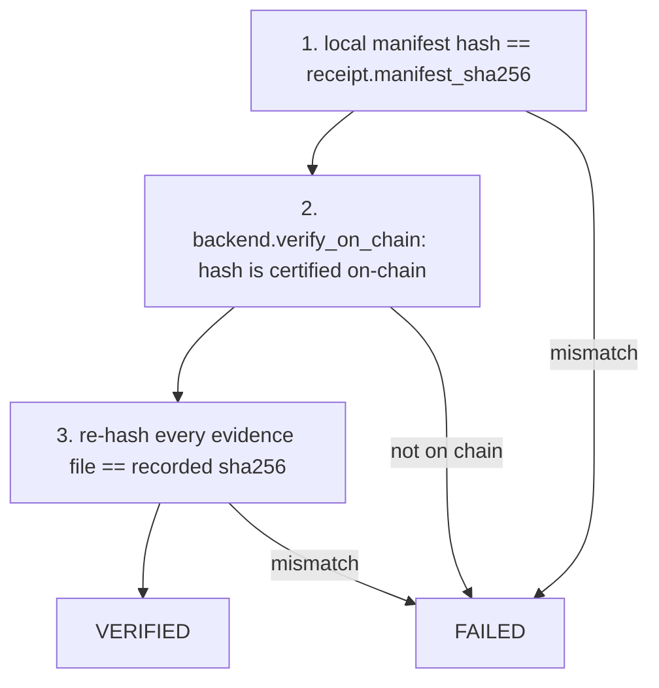
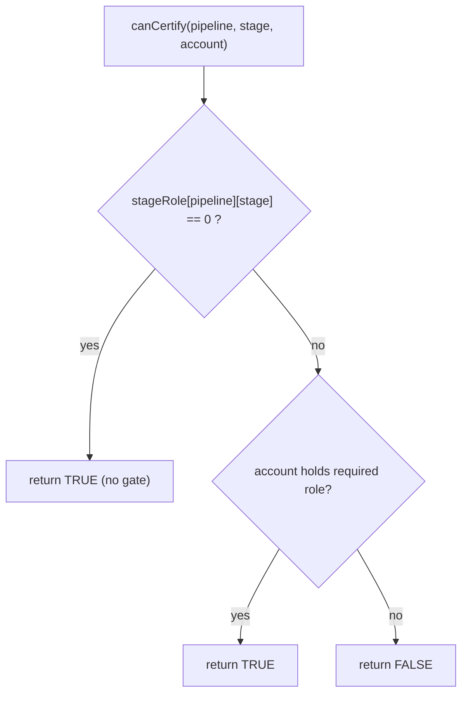
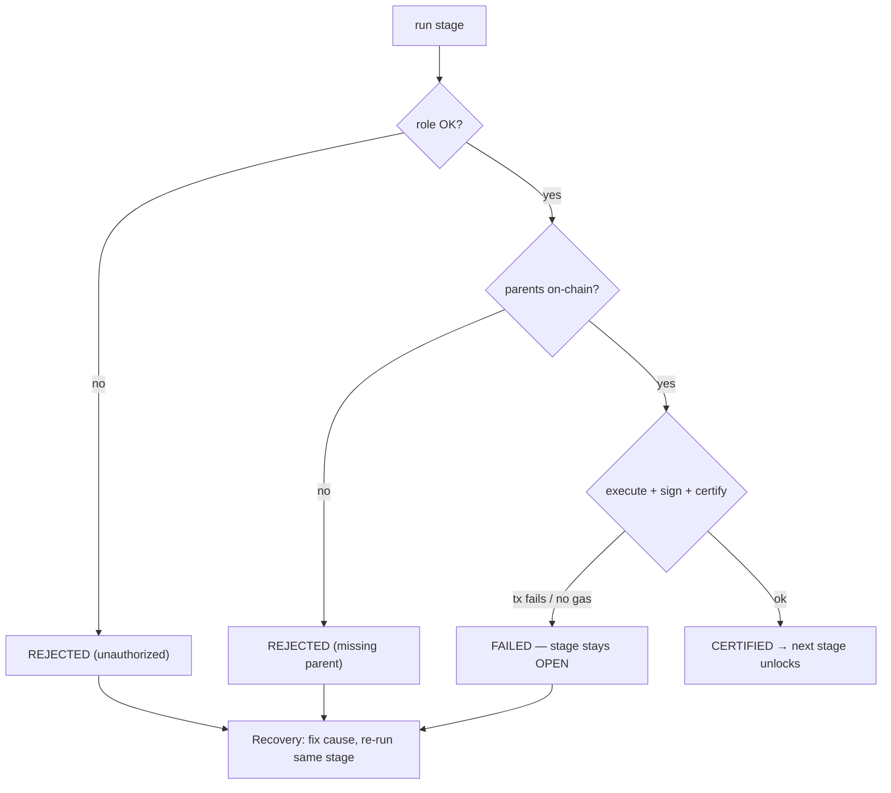

# Architecture & Design Notes

Deep technical companion to the [README](../README.md). Covers the data model,
contracts, verification logic, key design decisions, gas methodology, and the
security analysis.

## Table of Contents
1. [Manifest & certificate model](#1-manifest--certificate-model)
2. [Verification model (hash-based)](#2-verification-model-hash-based)
3. [Contracts in detail](#3-contracts-in-detail)
4. [Role resolution & the fail-open gap](#4-role-resolution--the-fail-open-gap)
5. [Design decision: reusing the compute scripts (“Option A”)](#5-design-decision-reusing-the-compute-scripts-option-a)
6. [Reject / recovery path](#6-reject--recovery-path)
7. [Gas & cost methodology](#7-gas--cost-methodology)
8. [Known limitations](#8-known-limitations)

---

## 1. Manifest & certificate model

A **manifest** is the off-chain JSON that fully describes one stage. Only its
SHA-256 hash is anchored on-chain.

```jsonc
{
  "schema_version": "2.0",
  "project_id": "iris_certified_ai_mvp",
  "certificate_type": "cleaning",              // stage name
  "created_at_utc": "2026-08-16T03:04:16Z",    // makes each run's hash unique
  "evidence_files": [
    { "role": "cleaned_dataset",
      "path": "data/processed/iris_cleaned.csv",
      "sha256": "8ad2b347..." }                // hash of the actual artifact
  ],
  "parent_certificates": [
    { "role": "dataset", "manifest_sha256": "9c0563f9...",
      "network": "amoy", "tx_id": "ac0fe4eb...", "block_id": "45030952" }
  ],
  "metadata": { "cleaning_version": "cleaning_v3" }
}
```

- **`manifest_sha256`** = `sha256(manifest_file_bytes)` — the on-chain key.
- **`evidence_files[].sha256`** = hash of each real artifact; re-hashed at verify
  time to detect tampering.
- **`parent_certificates[].manifest_sha256`** = the on-chain link to a parent.
  Only *direct* parents are listed; ancestry is derived by traversal.

An on-chain **certificate** (`Certificate` struct in V2) stores:
`pipelineId, manifestHash, stage, parents[], submitter, timestamp, exists`.
The manifest text is **not** stored — the hash is the proof.

---

## 2. Verification model (hash-based)

`verify_certificate.py` proves three independent things:



Because only the hash is stored on-chain, verification is **hash-based**: recompute
locally and compare to what the contract holds. The reviewer service extends this
to a **full-chain audit** — it repeats all three checks for every ancestor
(dataset → environment → cleaning → training) before approving the model.

---

## 3. Contracts in detail

### RoleManager.sol
Per-pipeline access control; knows nothing about certificates.

| Function | Purpose |
|---|---|
| `createPipeline() → id` | caller becomes `pipelineAdmin[id]` |
| `grantRole(id, role, acct)` / `revokeRole(...)` | admin-only |
| `setStageRole(id, stage, role)` | map a stage to the role required to certify it |
| `canCertify(id, stage, acct) → bool` | `stageRole==0 ? true : hasRole(...)` |

Roles are `bytes32` = `keccak256("DATA_CLEANER" | "MODEL_TRAINER" | "REVIEWER")`.

### CertificationRegistryV2.sol
Certificates keyed by `(pipelineId, manifestHash)`.

```solidity
function storeCertificate(uint256 pipelineId, bytes32 manifestHash,
                          string stage, bytes32[] parents) external {
    require(manifestHash != 0, "empty manifest hash");
    require(!certificates[key].exists, "certificate already exists");
    require(roleManager.canCertify(pipelineId, stage, msg.sender),
            "caller not authorized for stage");           // <-- delegates to RoleManager
    for (i in parents) require(certificates[key(pipelineId,parents[i])].exists,
            "parent certificate not found");              // <-- parent chain enforced
    // ...store, push to allKeys, emit CertificateStored
}
```
Read side: `isCertified(id, hash)`, `getCertificate(id, hash)` →
`(stage, parents, submitter, timestamp)`.

The two-contract split means role policy can evolve independently of the
certificate ledger, and the same registry deploys unchanged on any EVM chain.

---

## 4. Role resolution & the fail-open gap

`canCertify` treats "no role set" as "open":



This is **correct for root stages** (dataset/environment are meant to be
role-free). But it also means:

> On a pipeline where `setup_pipeline_roles` was **never run**, `stageRole` for
> *cleaning/training/model* is also `0`, so `canCertify` returns `true` for
> **anyone**. The role gate only bites on **properly initialized** pipelines.

Demonstrated against a never-created pipeline `99999`:

```
pipelineAdmin(99999)              = 0x000...000   (never created)
stageRole(99999,'cleaning')       = 0x000...000
canCertify(99999,'cleaning', A)   = True          # fail-open
```

**Mitigation (fail-closed guard, no redeploy):** before running a non-root stage,
require both `pipelineAdmin(id) != 0` and `getStageRole(id, stage) != 0`; otherwise
reject with `pipeline not initialized`. This can live in the stage services and/or
the orchestrator.

---

## 5. Design decision: reusing the compute scripts (“Option A”)

`clean_data.py` and `train_model.py` predate the multi-actor design and each run
their **own** parent verification through the single-actor `polygon_backend`.
Rather than fork them, the multi-actor stage services **keep them untouched** and
pass the `polygon_*` parent paths so their internal check passes against the V1
contract. Meanwhile the *real* multi-actor parent check happens on V2 (Step 4 of
each service).

Why this matters:
- The single-actor demo (`run_polygon_demo.sh`) keeps working unchanged.
- Parent verification for a stage is effectively performed **multiple times**
  (service Step 4 on V2 → `submit()` pre-flight → the contract `require`), so the
  redundant V1 check adds no security, only compatibility.
- The parent paths in `clean_data.py`/`train_model.py` were made **CLI-configurable**
  (with defaults preserving the original behavior) to enable this.

---

## 6. Reject / recovery path

Every guard is fail-stop: a failed role/parent check, or an out-of-gas actor,
halts that stage and leaves it **open** for retry — nothing downstream proceeds.



The orchestrator surfaces the failing stage and its reason; because status is
derived from on-chain state, a fixed-and-retried stage simply becomes `CERTIFIED`
and the run can continue.

---

## 7. Gas & cost methodology

- Only the 32-byte hash is written, so there is **no variable payload** — cost is
  `gas_used × gas_price`, converted POL → EUR by `estimate_cost_polygon.py`.
- Gas scales with **parent count** (each parent = one `bytes32` stored + one
  `require(exists)`), visible in the per-stage table in the README.
- The Circular baseline used a fee-function over on-chain payload size; the
  Polygon figure is measured from real receipts. Result: **≈ €0.32 → ≈ €0.014**
  for a full pipeline (~23×).


---

*Companion to the main [README](../README.md).*