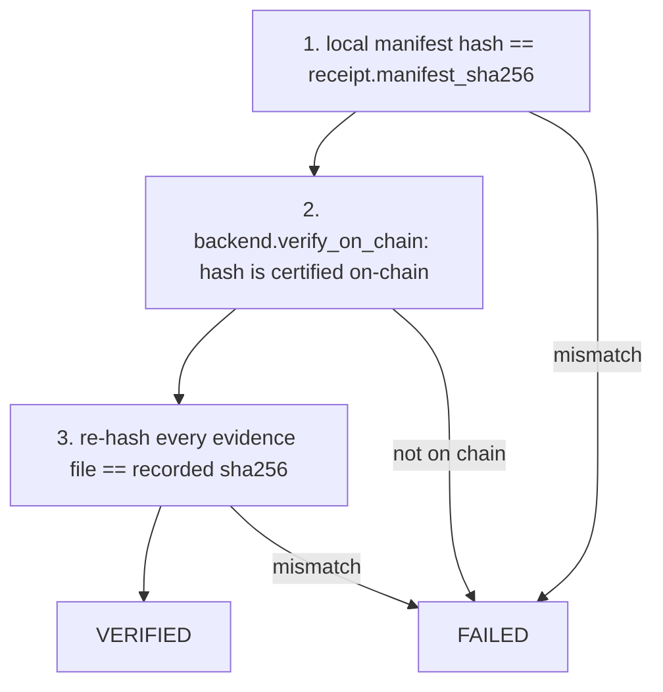

# Architecture & Design Notes

Deep technical companion to the [README](../README.md). Covers the data model,
contracts, verification logic, key design decisions, gas methodology, and the
security analysis.

## Table of Contents
1. [Manifest & certificate model](#1-manifest--certificate-model)
2. [Verification model (hash-based)](#2-verification-model-hash-based)
3. [Contracts in detail](#3-contracts-in-detail)
4. [Role resolution & the fail-open gap](#4-role-resolution--the-fail-open-gap)
5. [Design decision: reusing the compute scripts (“Option A”)](#5-design-decision-reusing-the-compute-scripts-option-a)
6. [Reject / recovery path](#6-reject--recovery-path)
7. [Gas & cost methodology](#7-gas--cost-methodology)
8. [Known limitations](#8-known-limitations)

---

## 1. Manifest & certificate model

A **manifest** is the off-chain JSON that fully describes one stage. Only its
SHA-256 hash is anchored on-chain.

```jsonc
{
  "schema_version": "2.0",
  "project_id": "iris_certified_ai_mvp",
  "certificate_type": "cleaning",              // stage name
  "created_at_utc": "2026-08-16T03:04:16Z",    // makes each run's hash unique
  "evidence_files": [
    { "role": "cleaned_dataset",
      "path": "data/processed/iris_cleaned.csv",
      "sha256": "8ad2b347..." }                // hash of the actual artifact
  ],
  "parent_certificates": [
    { "role": "dataset", "manifest_sha256": "9c0563f9...",
      "network": "amoy", "tx_id": "ac0fe4eb...", "block_id": "45030952" }
  ],
  "metadata": { "cleaning_version": "cleaning_v3" }
}
```

- **`manifest_sha256`** = `sha256(manifest_file_bytes)` — the on-chain key.
- **`evidence_files[].sha256`** = hash of each real artifact; re-hashed at verify
  time to detect tampering.
- **`parent_certificates[].manifest_sha256`** = the on-chain link to a parent.
  Only *direct* parents are listed; ancestry is derived by traversal.

An on-chain **certificate** (`Certificate` struct in V2) stores:
`pipelineId, manifestHash, stage, parents[], submitter, timestamp, exists`.
The manifest text is **not** stored — the hash is the proof.

---

## 2. Verification model (hash-based)

`verify_certificate.py` proves three independent things:



Because only the hash is stored on-chain, verification is **hash-based**: recompute
locally and compare to what the contract holds. The reviewer service extends this
to a **full-chain audit** — it repeats all three checks for every ancestor
(dataset → environment → cleaning → training) before approving the model.

---

## 3. Contracts in detail

### RoleManager.sol
Per-pipeline access control; knows nothing about certificates.

| Function | Purpose |
|---|---|
| `createPipeline() → id` | caller becomes `pipelineAdmin[id]` |
| `grantRole(id, role, acct)` / `revokeRole(...)` | admin-only |
| `setStageRole(id, stage, role)` | map a stage to the role required to certify it |
| `canCertify(id, stage, acct) → bool` | `stageRole==0 ? true : hasRole(...)` |

Roles are `bytes32` = `keccak256("DATA_CLEANER" | "MODEL_TRAINER" | "REVIEWER")`.

### CertificationRegistryV2.sol
Certificates keyed by `(pipelineId, manifestHash)`.

```solidity
function storeCertificate(uint256 pipelineId, bytes32 manifestHash,
                          string stage, bytes32[] parents) external {
    require(manifestHash != 0, "empty manifest hash");
    require(!certificates[key].exists, "certificate already exists");
    require(roleManager.canCertify(pipelineId, stage, msg.sender),
            "caller not authorized for stage");           // <-- delegates to RoleManager
    for (i in parents) require(certificates[key(pipelineId,parents[i])].exists,