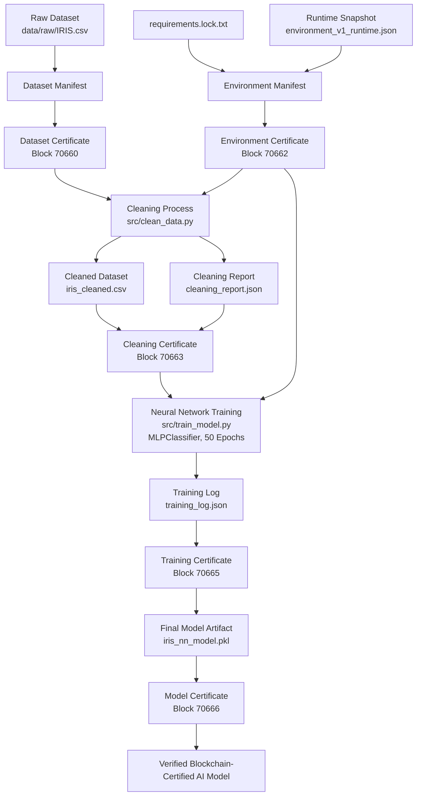

# Blockchain-Certified AI Pipeline Flow

## Project Overview

This project implements a terminal-based AI pipeline in which each major artifact is certified through the Circular Testnet blockchain.

The machine-learning task uses the Iris dataset and a simple Multi-Layer Perceptron neural network. The primary objective is not maximum prediction accuracy, but traceable and tamper-evident provenance of the dataset, environment, cleaning process, training process and final model artifact.

## Certified Pipeline Flow



## Certificate Chain

| Certificate             | Purpose                                                        | Parent Certificate(s)  | Block ID | Transaction ID                                                     |
| ----------------------- | -------------------------------------------------------------- | ---------------------- | -------: | ------------------------------------------------------------------ |
| Dataset Certificate     | Certifies the raw Iris dataset hash                            | None                   |    70660 | `aa61c7c8d508cbfb95e53f2a5137a57f635ea97933ebbf1322d319120443bc0d` |
| Environment Certificate | Certifies exact dependencies and runtime snapshot              | None                   |    70662 | `07962f0c2be7757d31a821c75a7ad8427fde5c9cf0b7499df42f1da6db2040d2` |
| Cleaning Certificate    | Certifies cleaning script, cleaned dataset and cleaning report | Dataset + Environment  |    70663 | `65a50f87bdac42c1396844a96dd83323eac73a1a87fb720a3dc1003cfff07007` |
| Training Certificate    | Certifies neural-network training script and training log      | Cleaning + Environment |    70665 | `7eb4563f02e76d1f449219944349881f3dd7da26b70c2a7e751eac0466c74771` |
| Model Certificate       | Certifies the final trained neural-network model artifact      | Training               |    70666 | `bc30c61d4d48b3bebd4a74f3f03bf9d3dbf06bb4982fb86fb2f2258ba7a44ba5` |

## Model Training Summary

| Item            | Value                                                              |
| --------------- | ------------------------------------------------------------------ |
| Dataset         | Iris Classification Dataset                                        |
| Model Type      | Multi-Layer Perceptron Neural Network                              |
| Hidden Layer    | 8 neurons                                                          |
| Training Epochs | 50                                                                 |
| Random Seed     | 42                                                                 |
| Final Accuracy  | 0.5667                                                             |
| Model Artifact  | `artifacts/models/iris_nn_model.pkl`                               |
| Model SHA-256   | `968b582b0bf0151236002abe0517f6651151eaaa78031ba88a6e915e6e3e3974` |

## How Certification Works

Each certificate follows the same reusable process:

```text
Relevant artifact or output file
        ↓
SHA-256 hash stored in a manifest JSON file
        ↓
Manifest JSON submitted to Circular Testnet
        ↓
Blockchain receipt saved locally with TxID and Block ID
        ↓
Generic verifier retrieves the on-chain manifest
        ↓
Local evidence hashes are recalculated and compared
```

## Verification Commands

### Dataset Certificate

```bash
python src/verify_certificate.py \
  --manifest certificates/manifests/dataset_manifest.json \
  --receipt certificates/receipts/dataset_receipt.json
```

### Environment Certificate

```bash
python src/verify_certificate.py \
  --manifest certificates/manifests/environment_v1_manifest.json \
  --receipt certificates/receipts/environment_v1_receipt.json
```

### Cleaning Certificate

```bash
python src/verify_certificate.py \
  --manifest certificates/manifests/cleaning_v1_manifest.json \
  --receipt certificates/receipts/cleaning_v1_receipt.json
```

### Training Certificate

```bash
python src/verify_certificate.py \
  --manifest certificates/manifests/training_v1_manifest.json \
  --receipt certificates/receipts/training_v1_receipt.json
```

### Model Certificate

```bash
python src/verify_certificate.py \
  --manifest certificates/manifests/model_v1_manifest.json \
  --receipt certificates/receipts/model_v1_receipt.json
```

## Final Result

The final neural-network model is linked to a verifiable blockchain certificate chain covering:

```text
Raw Dataset → Environment → Cleaning → Training → Final Model
```

Any modification to a certified artifact changes its SHA-256 hash and causes certificate verification to fail.
